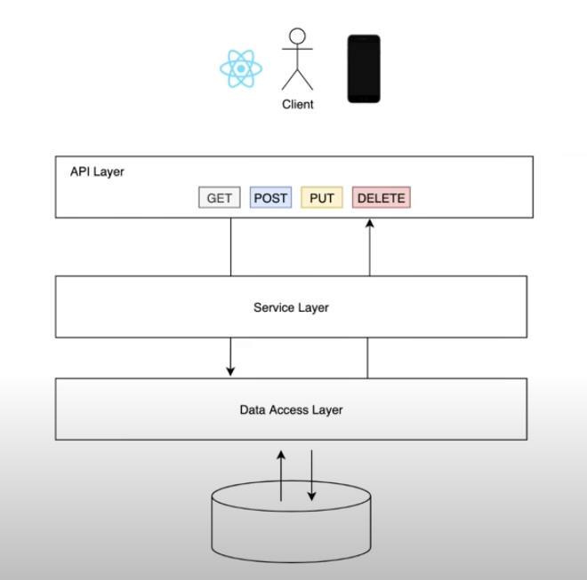

# Ecommerce Demo

A simple e-commerce platform that allows users to browse products, add
them to their cart, and proceed to checkout.

## Table of Contents

- [Technologies](#technologies)
- [Features](#features)
- [Assumptions and Trade Offs](#assumptions-and-trade-offs)
  - [Assumptions](#assumptions)
  - [Trade Offs](#trade-offs)
- [Project Structure](#project-structure)
- [Running The Backend](#running-the-backend)
- [Road Map](#road-map)

## Technologies

- Java / Spring Boot for the backend (Database: PostgreSQL)

## Features

The following features are currently implemented.
- Adding products to cart.
- Checkout products in cart.
- Customer Login with Phone Number Demo (OTP is not implemented).
- View order history.

## Assumptions and Trade Offs

### Assumptions
- Stock is unlimited, hence not being tracked for purposes of this demo.

### Trade Offs
- Repetive schema between order items and products. This was done to make order item act as a snapshot of the product at the time of purchase. This was done to avoid future changes to the product affecting the order history.

## Project Structure

The folder struture is divided into domains (product, order, user), each domain has its own controller (API layer), service, repository and model (Data Access Layer).

## Running The Backend
To get started with this project, you will need to have the following installed on your local machine:

* JDK 17+
* Gradle 7+

To build and run the project, follow these steps:

* Clone the repository: `git clone https://github.com/daverockz/ecommerce-demo-api`
* Navigate to the project directory: `cd ecommerce-demo-api`
* Add database "minexcommerce" to postgres
* Build the project: `./gradlew clean build`
* Run the project: `./gradlew bootRun`

-> The application will be available at http://localhost:8080.

## Road map
- Stock Management
- Product Variants
- Product Categories
